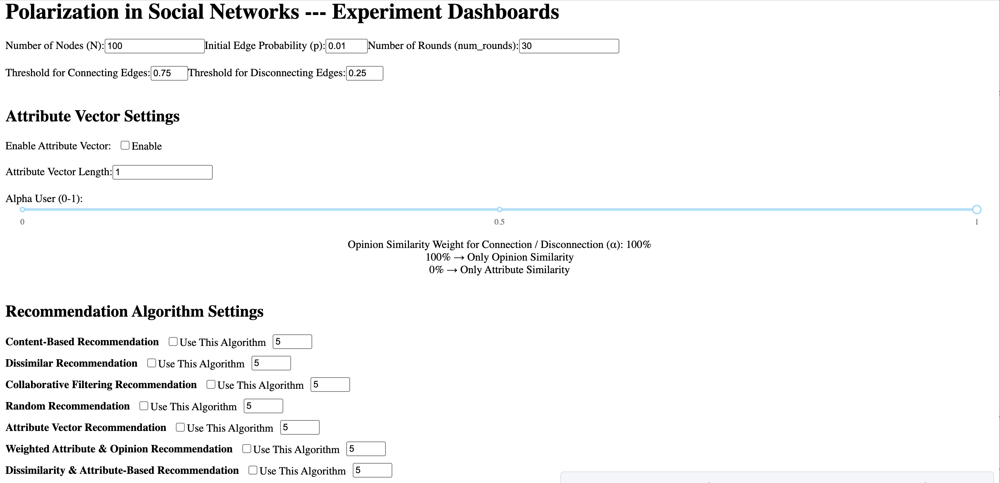
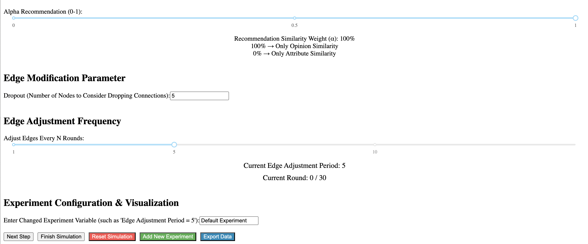

# polarization-simulator - An Experiment Dashboard

This interactive dashboard simulates polarization phenomena in social networks under various connection and recommendation strategies. It allows users to test different edge thresholds and recommendation algorithms to visualize how they affect opinion distribution, network structure, and polarization.

---

## 🛠 Installation & Dependencies

**Recommended: Python 3.9+**

Install required packages:

```bash
pip install dash plotly networkx pandas scikit-learn matplotlib
```

Optional: Create a virtual environment:

```bash
python3 -m venv env
source env/bin/activate  # On Windows use: env\Scripts\activate
```

---

## 🚀 Quick Start

1. Clone this repository and navigate to the project directory.
2. Run the following command:

```bash
python3 new_exp_four_new_rec_algo.py
```

3. Open your browser and visit:  
   `http://127.0.0.1:8050`

You should see the dashboard like below:

  


---

## 🎛 Dashboard Settings Overview

The dashboard allows customization of multiple experimental parameters:

- **Basic Network Settings**:
  - Number of Nodes (N)
  - Initial Edge Probability (p)
  - Number of Rounds (num_rounds)

- **Edge Thresholds**:
  - Threshold for Connecting Edges
  - Threshold for Disconnecting Edges

- **Edge Modification Parameter**:
  - **Dropout**: Number of nodes randomly selected each round to evaluate whether to drop any of their connections. This controls dynamic edge removal in the network.

- **Edge Adjustment Frequency**:
  - Adjust Edges Every N Rounds: Control how frequently (every N rounds) nodes are allowed to modify their connections. Larger values slow down structural changes.

- **Attribute Vector Settings**:
  - **Enable Attribute Vector**: Toggle whether nodes have attribute vectors (e.g., interests or demographic traits).
  - **Attribute Vector Length**: Define the number of dimensions in each node’s attribute vector.
  - **Alpha User (0–1)**: Adjusts the relative importance of opinion similarity vs. attribute similarity **for edge formation and removal only**.

- **Recommendation Algorithm Options**:
  - **Standard Algorithms** (commonly found in literature):
    - **Content-Based Recommendation**: Recommends nodes with similar opinions to the target node.
    - **Collaborative Filtering**: Suggests connections based on shared neighbors (similar to social filtering).
    - **Random Recommendation**: Selects unconnected nodes at random.

  - **Custom Algorithms for Experimental Comparison**:
    - **Dissimilar Recommendation**: Prioritizes nodes with opposing opinions to the target, used to study exposure to disagreement.
    - **Attribute-Based Recommendation**: Recommends nodes based solely on attribute vector similarity (e.g., interests, demographics).
    - **Weighted Attribute & Opinion Recommendation**: Combines opinion and attribute similarity with a tunable weight α.
    - **Dissimilarity & Attribute-Based Recommendation**: Merges opinion dissimilarity with attribute similarity to encourage diverse yet relatable connections.

- **Recommendation Similarity Weight (α)**:
  - This parameter **only affects some hybrid algorithms** (e.g., *Weighted Attribute & Opinion Recommendation*, *Dissimilarity & Attribute-Based Recommendation*).
  - It determines the balance between **opinion similarity** and **attribute similarity**:
    - `α = 1.0` → recommendation is fully based on **opinion**
    - `α = 0.0` → recommendation is fully based on **attribute**
    - `0 < α < 1` → uses a weighted combination of both
  - For standard algorithms like *Content-Based*, *Random*, *Collaborative Filtering*, or individual-only strategies like *Dissimilar Recommendation* or *Attribute-Based Recommendation*, this setting has **no effect**.

- **Experiment Configuration & Visualization**:
  - **Experiment Label**: A custom text label that names the experiment. This label is used to distinguish multiple curves in the result charts.

---

## 🕹 Control Panel Functions

- **Next Step**: Advance the simulation by one round
- **Finish Simulation**: Run the simulation to completion
- **Reset Simulation**: Clear the current state
- **Add New Experiment**: Store the current experiment and initialize a new run
- **Export Data**: Download results as a JSON file

---

## 📊 Metrics & Visualization

After or during simulation, the dashboard displays these visual analytics:

- **Polarization Over Time**
- **Radicalization Over Time**
- **Average Degree Over Time**
- **Echo Chamber Extent Over Time**
- **Modularity Over Time**
- **Opinion Distribution (2D PCA Projection)**
- **Opinion Histogram (All Dimensions)**

These plots help assess polarization trends and network evolution.

---

## 🧪 Example Experiment Result

The following is a visualization of the network structure after 30 rounds, using 500 nodes, a similarity threshold of 0.75, dropout threshold of 0.25, and content-based recommendation to simulate random search of users:


Clusters demonstrate strong polarization and echo chamber effects.

---

## 📁 File Structure

```
├── base_code.py                  # Core model for simulation
├── new_exp_four_new_rec_algo.py # Main dashboard and UI logic
├── LICENSE
├── README.md
├── assets/
│   ├── dashboard_overview1.png
│   ├── dashboard_overview2.png
│   └── Graph After.png
```

---

## 📬 Contact

If you have any questions or suggestions, feel free to reach out or open an issue on GitHub.
